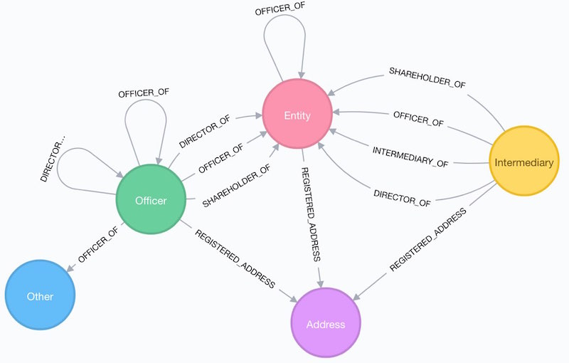

# Tax Fraud and NLP Demo

I'll use this repository to create a brief demo in using NLP techniques with the goal of creating a tax fraud ontology. 

## The data
For purposes 
## Wikipedia Articles

## The Panama Papers Database

The Panama Papers are a set of 11.5 million document leaks from Panamanian law company ”Mossack Fonseca”, which provides information on approximately 360,000 businesses and individuals in more than 200 countries linked to offshore structures and covering a time period of nearly 40 years, from 1977 to 2016.

Link: https://www.occrp.org/en/panamapapers/database

The  ”ICIJ  Offshore”  database,  presents  the  network  of  relationships  between  companies  and  individual  people  with  offshore  companies based in tax havens. Consists in a directed and unweighted network based on commercial  registration  of  all  types  of  companies  involved  in  the  scandal  and the existing relations type, which are:

| **Text** | ** Meaning In Document**       |
| ------------- |:-------------:|
|"director of”| Refers to the person appointed to the company’s management.|
|"director of” | Refers to the person appointed to the company’s management.|
|”address” | Refers to the address through which was possible to establish the country origin of the company.|
|”shareholder of” | If it holds a stake in an offshore company.|
|”intermediary of” | If it mediates companies in access to offshores.|
| ”similar of” | If the company is related to another company, among other attributes.|

# How The Data Is Structured:
Below is a break down between the different roles of Entity, Officer, and Intermediary.

(source:https://guides.neo4j.com/sandbox/icij-paradise-papers/datashape.html)

When interpreting the graph, it will be important to understand the obligation that each person or person(s) has within the network.  

* **Entity** (offshore)
  Company, trust or fund created in a low-tax, offshore jurisdiction by an agent.

* **Officer**
  Person or company who plays a role in an offshore entity.

* **Intermediary**
  A go-between for someone seeking an offshore corporation
  and an offshore service provider - usually a law-firm or a middleman that asks an offshore service provider to create an offshore firm for a client.

* **Address**
  A contact postal address as it appears in the original databases
  obtained by ICIJ.

# Global Breakdown Of The Entire Panama Paper Corpus

In table 1, breaks down the file structure of how the entire corpus of documents provided by the ICIJ.

| Name          | Type          | Purpose | # of rows | Columns of interest |
| ------------- |:-------------:| -------:|----------:|------------:|
|  panama_papers_edges.csv    |    Edge       |   Each edge has a type of the represented relationship | 1,269,796    |   START_ID, TYPE, END_ID      |
| panama_papers_addresses.csv |    Nodes      |   Legal addresses of officers and entities  |   151,127  |      n/a   |
| panama_papers_entity.csv  |    Nodes      |   Legal entities (corporations, firms, and so on) |   319,421   |     name, jurisdiction    |
| panama_papers_intermediary.csv|    Nodes      |  Persons and organizations that act as links between other organizations| 23,642 |  name, country_code  |
| panama_papers_officer.csv  |    Nodes      | Persons (directors, shareholders, and so on)| 345,645 | name, country_code |

